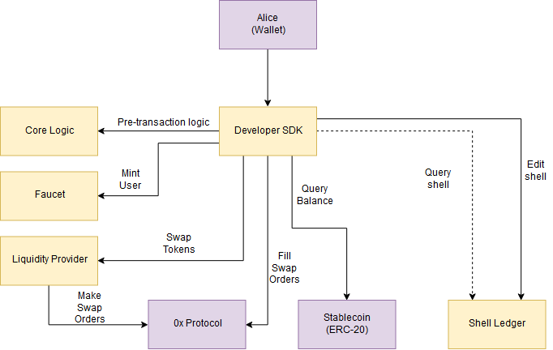

# Cowri Architecture

## Version 0.2.0

Version 0.2.0 of the Cowri architecture is the architecture in place until the on-chain Cowri protocol has finished development. It has been built in such a way that the current off-chain logic of the liquidity provider can easily be replaced with the on-chain protocol once it is completed, so it is important to understand that while version 0.2.0 is functional, certain components will be replaced. Until then, version 0.2.0 consists of the following modules:

### Cowri DApp SDK
The **Cowri DApp SDK** is the keystone of the Cowri protocol and acts as the central hub for developer interaction with the functions available with Cowri. It interacts with all the other Cowri modules either by calling code directly or interacting with them via network protocols. The Cowri DApp SDK is available on NPM and can easily be installed and implemented for any DApp developer to use Cowri in their applications. 

### Cowri Core
**Cowri Core** is the module of Cowri where all of the core business logic takes place. It is where the Token, Transaction, User, and Shell objects live and is also home to the token selection algorithms that form the core of the Cowri payment protocol. It is also an NPM module as to allow the internal objects to be shared amongst the Faucet, Liquidity Provider, and any other service that would like access to these objects and algorithms. 

### Faucet
The **Faucet** is an API service built on Express that allows for the minting of supported ERC20 tokens for development purposes on test networks. It runs as a standalone service alongside the other Cowri services and can be started using either Docker or with an NPM script. An image for the faucet has also been published to Docker Hub. 

### Liquidity Provider
The **Liquidity Provider** is also a standalone API service built on Express that currently provides liquidity to the Cowri protocol. Like the Faucet, an image for the liquidity provider has been published to Docker Hub and also can be started with an NPM command. It utilizes the 0x protocol and is leveraged when sending Cowri that requires the swapping of stable coins. The Liquidity Provider API service is intended to be a temporary yet functional liquidity solution while the on-chain components are being developed. 
