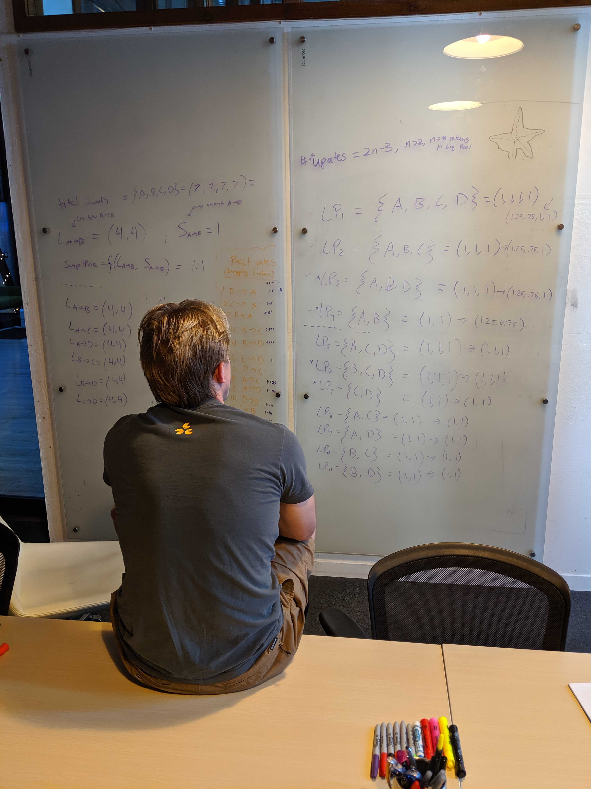
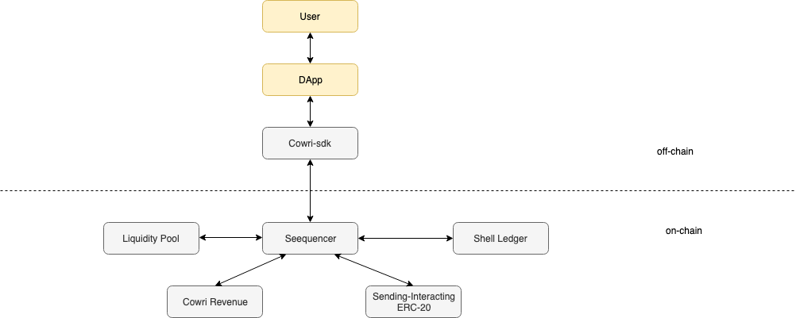

# Future Work

## Overview

**TBD - Kenny - your input here**
Cowri has created a protocol that allows stablecoins to interoperate, the Cowri shell protocol. With our decentralized protocol, users can hold and transact any number of different stablecoins as if they were using a single currency. The Cowri shell protocol can even accommodate users if they prefer completely different currencies. In effect, our platform creates internet money without issuing or holding any tokens or financial assets.

## Roadmap

Below is a high level roadmap for the Cowri Protocol
* User Release - June 2019
* Developer Release -  July 2019
* Cowri 1.0 - Q4 2019
* Cowri 2.0 - Q1 2020

## Components

### Cowri Protocol
The cowri protocol provides programmable money it leverages the past work of protocols such as 0x, UniSwap and Argent and Cosmos. It consists of the following key components to provide a complete protocol for enabling internet money.

**Cowri Shell Protocol** - The Cowri Shell Protocol provides a simple yet powerful registry to allow Users to manage their stablecoin preferences.

**Cowri Programmable Money** - Leveraging previous work by organizations such as [Argent](https://www.argent.xyz/). Cowri Programmable Money provides a protocol level solution to enable features such as
* Key Management and Simple Key Recovery
* Trusted Contracts
* Daily Transfer Limits
* Additional Security capabilities for Large Transfers

**Cowri Liquidity Pool** - Building upon and integrating with a number of DeCentralized Finance Solutions such as [0x-protocol](https://0x.org/), [Uniswap](https://uniswap.io/) and [dydx](https://dydx.exchange/). Cowri provides a best practice 

**Cowri Sequencer**

**Cowri Value On Ramp**

**Cowri Revenue Governance**

### Cowri Shell

### Cowri Platforms

### Cowri FIAT On Ramps

### Cowri Utiltities

