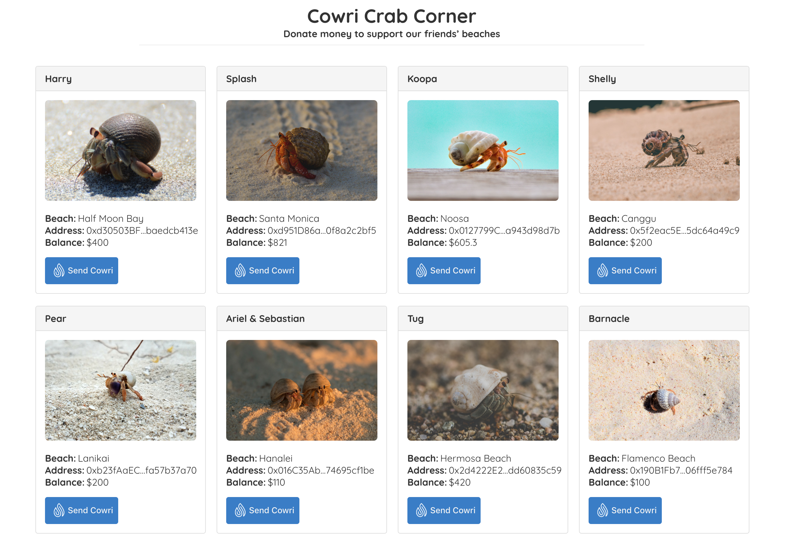
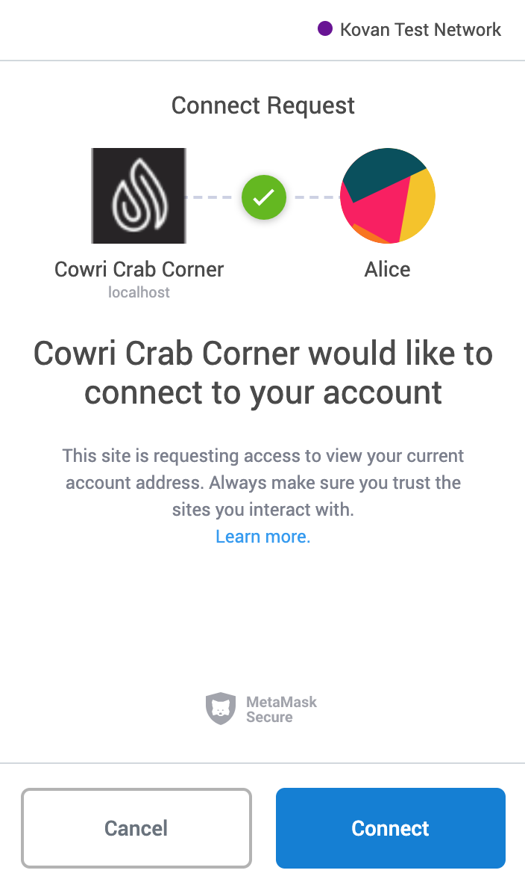
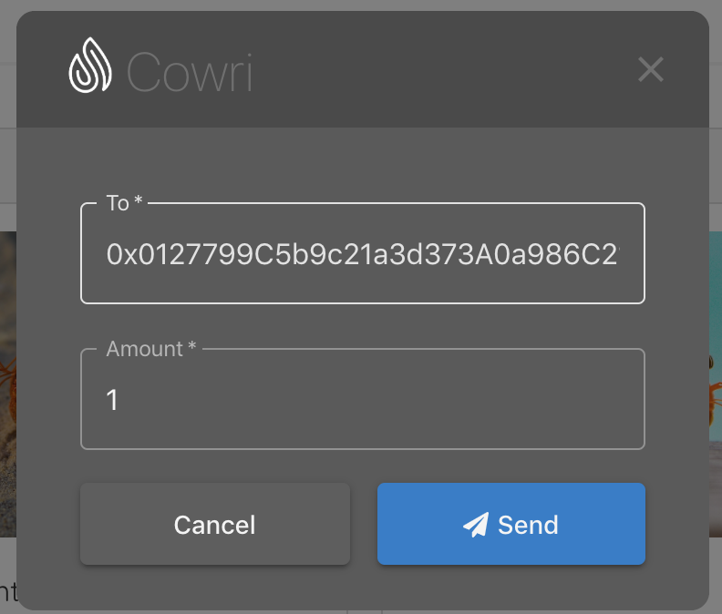
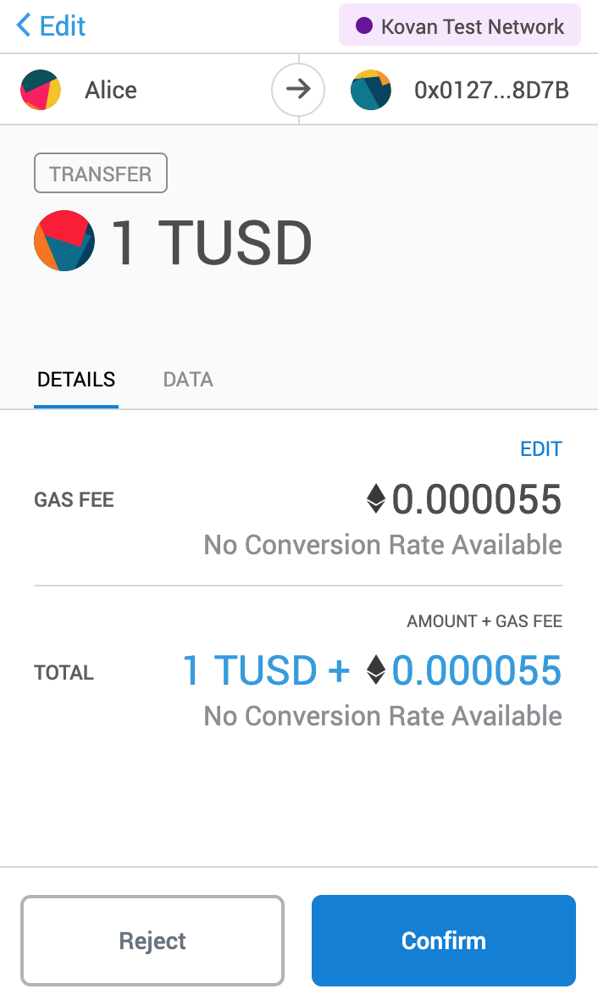
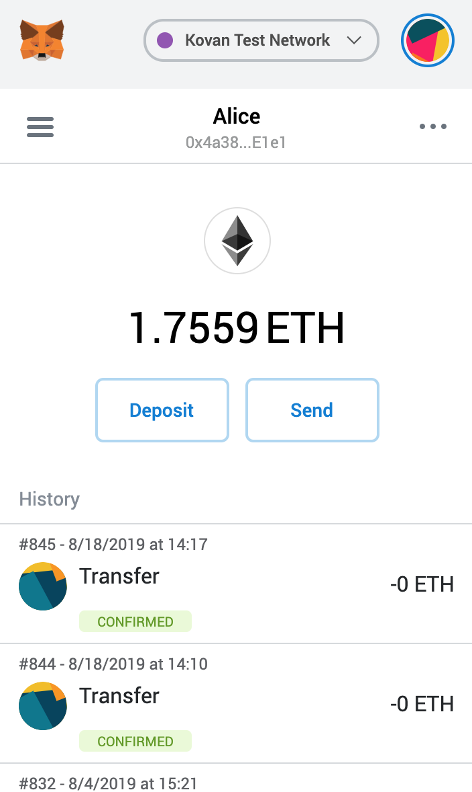

# Cowri Crab Corner Tutorial

This tutorial will take you through the process of building your first DApp---a stablecoin payment protocol integrated into Cowri Crab Corner!

This tutorial is meant for those with a basic knowledge of Ethereum and smart contracts, who have some knowledge of HTML, JavaScript and React, but who are new to DApps.

 **Note**: For Ethereum basics, please read the [Truffle Ethereum Overview](https://www.trufflesuite.com/tutorials/ethereum-overview) tutorial before proceeding.

In this tutorial we assume you have completed your [developer setup](installation.md). 

Here we will be covering:

1. Adding Send Cowri to your Application
2. Interacting with the dapp in a browser

## Background

Triton runs a non-profit, the Cowri Crab Corner, that helps his fellow hermit crabs keep their beaches clean. Every year, [8 million metric tons of plastic](https://www.earthday.org/2018/04/05/fact-sheet-plastics-in-the-ocean/) go into our oceans. Triton and his friends need all the help they can get! They are collecting donations for beach clean ups all around the world. Because this is a global problem, they need a borderless currency. Help Triton and his hermit crab friends build their dapp so they can accept funds from anywhere in the world.

Triton thinks that Cowri would be an efficient way to handle their hermit crab donations. As an initial proof of concept, **Triton wants to see a dapp that associates a** [**cowri shell**](../cowri-overview/protocol-description.md#stablecoin-shells) **with a hermit crab to receive donations for a beach clean up.**

The website structure and styling will be supplied. **Our job is to integrate with the cowri protocol and front-end logic for its usage.**

### Create the Cowri Shell for the Cowri Crab Corner DApp User

With MetaMask connected to Kovan, we now need to create a cowri shell for the current user in MetaMask:

1. Navigate to [https://demo.cowri.io](https://demo.cowri.io)
2. Connect your MetaMask instance when prompted
3. Select the tokens you wish to have in your shell and select `Make Cowri Shell`
   1. Notice how you have the option to add another token
   2. The creation of a Cowri Shell on Kovan will result in the minting of supported tokens

### Running Crab Corner

1. Clone the crab-corner-tutoral repository with 

```text
git clone http://github.com/cowri/crab-corner-tutorial.git
cd crab-corner-tutorial/crab-corner
npm install
npm start
```

2. Notice how the buttons by each crab don't do anything. It's our job to replace these buttons with the Cowri Send React buttons.

### Integrating Send Cowri \(React\)

With our Cowri Shell created on Kovan, we now need to implement our Send Cowri component. The Send Cowri React component takes the following _optional_ properties:

| Name | Type | Description |
| :--- | :--- | :--- |
| address | `string` | the receiver's public address |
| amount | `number` | the amount of cowri to send |

1. Install and save `@cowri/send-react`:

```bash
npm install @cowri/send-react --save
```

2. In `src/components/CardBody/CardBody.js` add the following import at the top of the file:

```javascript
import SendCowri from '@cowri/send-react';
```

3. Remove the following line:

```javascript
<Button text={'Donate'} />
```

4. Add `SendCowri` component and pass in `address` from props:

```javascript
<SendCowri address={address} />
```

## Interacting with the dapp in a browser

Now we're ready to use our dapp!

### Using the dapp

1. Start the local web server:

   ```bash
   npm start
   ```

   The dev server will launch and automatically open a new browser tab containing your dapp.

   

2. A MetaMask pop-up should appear requesting your approval to allow Cowri Crab Corner to connect to your MetaMask wallet. Without explicit approval, you will be unable to interact with the dapp. Click **Connect**.

   

3. To use the dapp, click the **Send Cowri** button on the hermit crab of your choice.
4. Type in an amount and click **Send**.

   

5. You'll be automatically prompted to approve the transaction by MetaMask. Click **Confirm** to approve the transaction.

   

6. In MetaMask, you'll see the transaction listed:

   


To see the updated balances in cowri crab corner **refresh** the page.


Congratulations! You have successfully integrated Cowri into the Cowri Crab Corner! For developing locally, you have all the tools you need to start making more advanced dapps.


**Congratulations**! 

**You have successfully integrated Cowri into the Cowri Crab Corner!** 

You have all the tools you need to start making more advanced DApps.


