# Cowri Crab Corner Tutorial

[**Follow this Tutorial**](https://www.trufflesuite.com/tutorials/pet-shop)

[**Solutions can be found here**](https://github.com/trufflesuite/pet-shop-tutorial)

\*\*[Tutorial Markdown Documentation can be found here](https://github.com/trufflesuite/trufflesuite.com/blob/master/src/tutorials/pet-shop.md)


This tutorial will take you through the process of building your first dapp---an adoption tracking system for a pet shop!

This tutorial is meant for those with a basic knowledge of Ethereum and smart contracts, who have some knowledge of HTML and JavaScript, but who are new to dapps.

 **Note**: For Ethereum basics, please read the Truffle \[Ethereum Overview\]\(/tutorials/ethereum-overview\) tutorial before proceeding.

In this tutorial we will be covering:

1. Setting up the development environment
2. Creating a Truffle project using a Truffle Box
3. Adding Send Cowri to your Application
4. Interacting with the dapp in a browser

## Background

Pete Scandlon of Pete's Pet Shop is interested in using Ethereum as an efficient way to handle their pet adoptions. The store has space for 16 pets at a given time, and they already have a database of pets. As an initial proof of concept, **Pete wants to see a dapp which associates an Ethereum address with a pet to be adopted.**

The website structure and styling will be supplied. **Our job is to write the smart contract and front-end logic for its usage.**

## Setting up the development environment

There are a few technical requirements before we start. Please install the following:

* [Node.js v8+ LTS and npm](https://nodejs.org/en/) \(comes with Node\)
* [Git](https://git-scm.com/)

Once we have those installed, we only need one command to install Truffle:

```text
npm install -g truffle
```

To verify that Truffle is installed properly, type `truffle version` on a terminal. If you see an error, make sure that your npm modules are added to your path.

We also will be using [Ganache](https://github.com/cowri/cowri-docs/tree/04d9b6dec5ee45ed731242763b10787dc6964125/ganache/README.md), a personal blockchain for Ethereum development you can use to deploy contracts, develop applications, and run tests. You can download Ganache by navigating to [http://truffleframework.com/ganache](http://truffleframework.com/ganache) and clicking the "Download" button.

 **Note**: If you are developing in an environment without a graphical interface, you can also use Truffle Develop, Truffle's built-in personal blockchain, instead of Ganache. You will need to change some settings---such as the port the blockchain runs on---to adapt the tutorial for Truffle Develop.

## Creating a Truffle project using a Truffle Box

1. Truffle initializes in the current directory, so first create a directory in your development folder of choice and then moving inside it.

   ```text
   mkdir pet-shop-tutorial

   cd pet-shop-tutorial
   ```

2. We've created a special [Truffle Box](https://github.com/cowri/cowri-docs/tree/04d9b6dec5ee45ed731242763b10787dc6964125/boxes/README.md) just for this tutorial called `pet-shop`, which includes the basic project structure as well as code for the user interface. Use the `truffle unbox` command to unpack this Truffle Box.

   ```text
   truffle unbox pet-shop
   ```

 **Note**: Truffle can be initialized a few different ways. Another useful initialization command is \`truffle init\`, which creates an empty Truffle project with no example contracts included. For more information, please see the documentation on \[Creating a project\]\(/docs/getting\_started/project\).

### Directory structure

The default Truffle directory structure contains the following:

* `contracts/`: Contains the [Solidity](https://solidity.readthedocs.io/) source files for our smart contracts. There is an important contract in here called `Migrations.sol`, which we'll talk about later.
* `migrations/`: Truffle uses a migration system to handle smart contract deployments. A migration is an additional special smart contract that keeps track of changes.
* `test/`: Contains both JavaScript and Solidity tests for our smart contracts
* `truffle-config.js`: Truffle configuration file

The `pet-shop` Truffle Box has extra files and folders in it, but we won't worry about those just yet.

### Instantiating web3

1. Open `/src/js/app.js` in a text editor.
2. Examine the file. Note that there is a global `App` object to manage our application, load in the pet data in `init()` and then call the function `initWeb3()`. The [web3 JavaScript library](https://github.com/ethereum/web3.js/) interacts with the Ethereum blockchain. It can retrieve user accounts, send transactions, interact with smart contracts, and more.
3. Remove the multi-line comment from within `initWeb3` and replace it with the following:

   ```javascript
   // Modern dapp browsers...
   if (window.ethereum) {
     App.web3Provider = window.ethereum;
     try {
       // Request account access
       await window.ethereum.enable();
     } catch (error) {
       // User denied account access...
       console.error("User denied account access")
     }
   }
   // Legacy dapp browsers...
   else if (window.web3) {
     App.web3Provider = window.web3.currentProvider;
   }
   // If no injected web3 instance is detected, fall back to Ganache
   else {
     App.web3Provider = new Web3.providers.HttpProvider('http://localhost:7545');
   }
   web3 = new Web3(App.web3Provider);
   ```

Things to notice:

* First, we check if we are using modern dapp browsers or the more recent versions of [MetaMask](https://github.com/MetaMask) where an `ethereum` provider is injected into the `window` object. If so, we use it to create our web3 object, but we also need to explicitly request access to the accounts with `ethereum.enable()`.
* If the `ethereum` object does not exist, we then check for an injected `web3` instance. If it exists, this indicates that we are using an older dapp browser \(like [Mist](https://github.com/ethereum/mist) or an older version of MetaMask\). If so, we get its provider and use it to create our web3 object.
* If no injected web3 instance is present, we create our web3 object based on our local provider. \(This fallback is fine for development environments, but insecure and not suitable for production.\)

### Instantiating the contract

Now that we can interact with Ethereum via web3, we need to instantiate our smart contract so web3 knows where to find it and how it works. Truffle has a library to help with this called `truffle-contract`. It keeps information about the contract in sync with migrations, so you don't need to change the contract's deployed address manually.

1. Still in `/src/js/app.js`, remove the multi-line comment from within `initContract` and replace it with the following:

   ```javascript
   $.getJSON('Adoption.json', function(data) {
     // Get the necessary contract artifact file and instantiate it with truffle-contract
     var AdoptionArtifact = data;
     App.contracts.Adoption = TruffleContract(AdoptionArtifact);

     // Set the provider for our contract
     App.contracts.Adoption.setProvider(App.web3Provider);

     // Use our contract to retrieve and mark the adopted pets
     return App.markAdopted();
   });
   ```

Things to notice:

* We first retrieve the artifact file for our smart contract. **Artifacts are information about our contract such as its deployed address and Application Binary Interface \(ABI\)**. **The ABI is a JavaScript object defining how to interact with the contract including its variables, functions and their parameters.**
* Once we have the artifacts in our callback, we pass them to `TruffleContract()`. This creates an instance of the contract we can interact with.
* With our contract instantiated, we set its web3 provider using the `App.web3Provider` value we stored earlier when setting up web3.
* We then call the app's `markAdopted()` function in case any pets are already adopted from a previous visit. We've encapsulated this in a separate function since we'll need to update the UI any time we make a change to the smart contract's data.

### Getting The Adopted Pets and Updating The UI

1. Still in `/src/js/app.js`, remove the multi-line comment from `markAdopted` and replace it with the following:

   ```javascript
   var adoptionInstance;

   App.contracts.Adoption.deployed().then(function(instance) {
     adoptionInstance = instance;

     return adoptionInstance.getAdopters.call();
   }).then(function(adopters) {
     for (i = 0; i < adopters.length; i++) {
       if (adopters[i] !== '0x0000000000000000000000000000000000000000') {
         $('.panel-pet').eq(i).find('button').text('Success').attr('disabled', true);
       }
     }
   }).catch(function(err) {
     console.log(err.message);
   });
   ```

Things to notice:

* We access the deployed `Adoption` contract, then call `getAdopters()` on that instance.
* We first declare the variable `adoptionInstance` outside of the smart contract calls so we can access the instance after initially retrieving it.
* Using **call\(\)** allows us to read data from the blockchain without having to send a full transaction, meaning we won't have to spend any ether.
* After calling `getAdopters()`, we then loop through all of them, checking to see if an address is stored for each pet. Since the array contains address types, Ethereum initializes the array with 16 empty addresses. This is why we check for an empty address string rather than null or other falsey value.
* Once a `petId` with a corresponding address is found, we disable its adopt button and change the button text to "Success", so the user gets some feedback.
* Any errors are logged to the console.

### Handling the adopt\(\) Function

1. Still in `/src/js/app.js`, remove the multi-line comment from `handleAdopt` and replace it with the following:

   ```javascript
   var adoptionInstance;

   web3.eth.getAccounts(function(error, accounts) {
     if (error) {
       console.log(error);
     }

     var account = accounts[0];

     App.contracts.Adoption.deployed().then(function(instance) {
       adoptionInstance = instance;

       // Execute adopt as a transaction by sending account
       return adoptionInstance.adopt(petId, {from: account});
     }).then(function(result) {
       return App.markAdopted();
     }).catch(function(err) {
       console.log(err.message);
     });
   });
   ```

Things to notice:

* We use web3 to get the user's accounts. In the callback after an error check, we then select the first account.
* From there, we get the deployed contract as we did above and store the instance in `adoptionInstance`. This time though, we're going to send a **transaction** instead of a call. Transactions require a "from" address and have an associated cost. This cost, paid in ether, is called **gas**. The gas cost is the fee for performing computation and/or storing data in a smart contract. We send the transaction by executing the `adopt()` function with both the pet's ID and an object containing the account address, which we stored earlier in `account`.
* The result of sending a transaction is the transaction object. If there are no errors, we proceed to call our `markAdopted()` function to sync the UI with our newly stored data.

## Interacting with the dapp in a browser

Now we're ready to use our dapp!

### Installing and configuring MetaMask

The easiest way to interact with our dapp in a browser is through [MetaMask](https://metamask.io/), a browser extension for both Chrome and Firefox.

1. Install MetaMask in your browser.
2. Once installed, a tab in your browser should open displaying the following:

   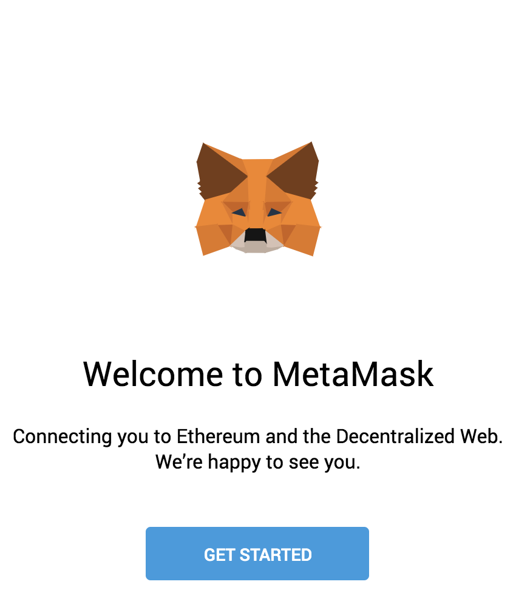

3. After clicking **Getting Started**, you should see the initial MetaMask screen. Click **Import Wallet**.

   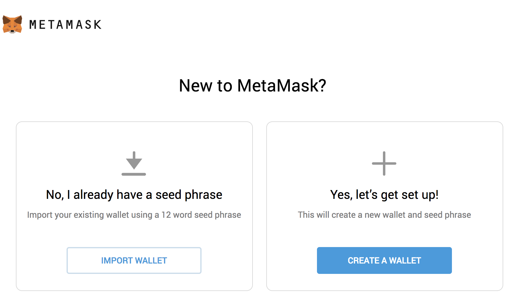

4. Next, you should see a screen requesting anonymous analytics. Choose to decline or agree.

   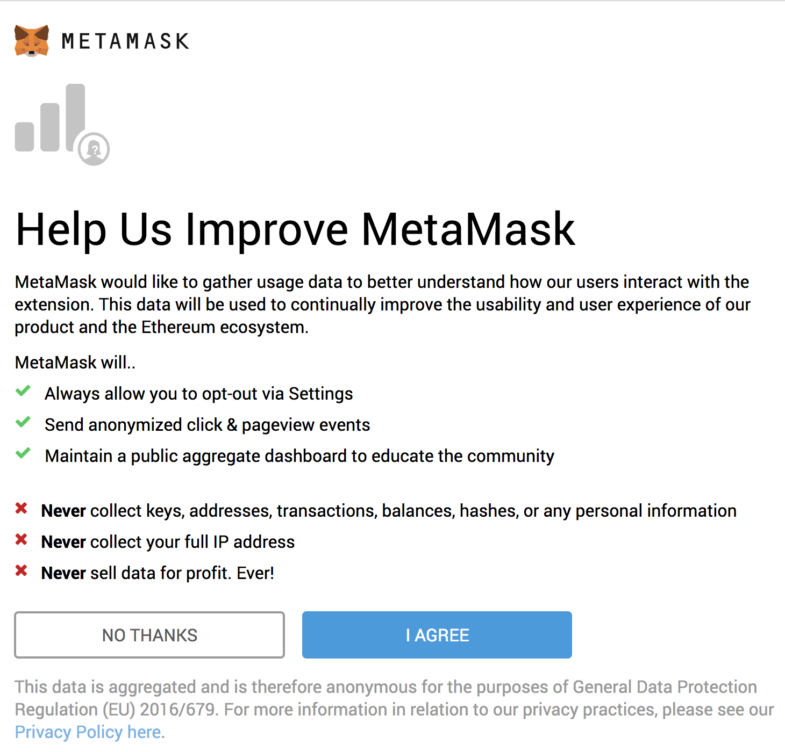

5. In the box marked **Wallet Seed**, enter the mnemonic that is displayed in Ganache.

    \*\*Warning\*\*: Do not use this mnemonic on the main Ethereum network \(mainnet\). If you send ETH to any account generated from this mnemonic, you will lose it all!

   Enter a password below that and click **OK**.

   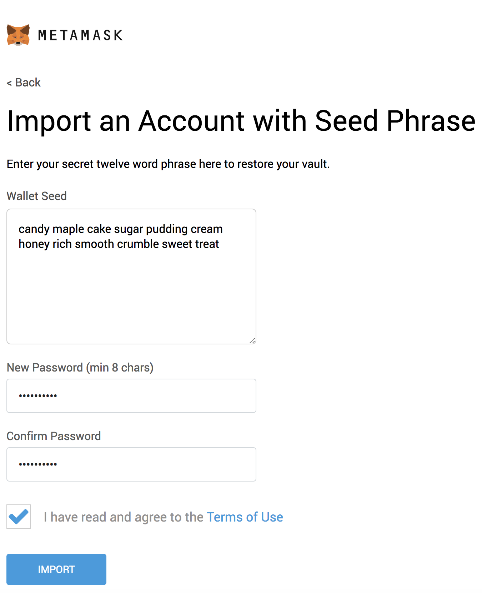

6. If all goes well, MetaMask should display the following screen. Click **All Done**.

   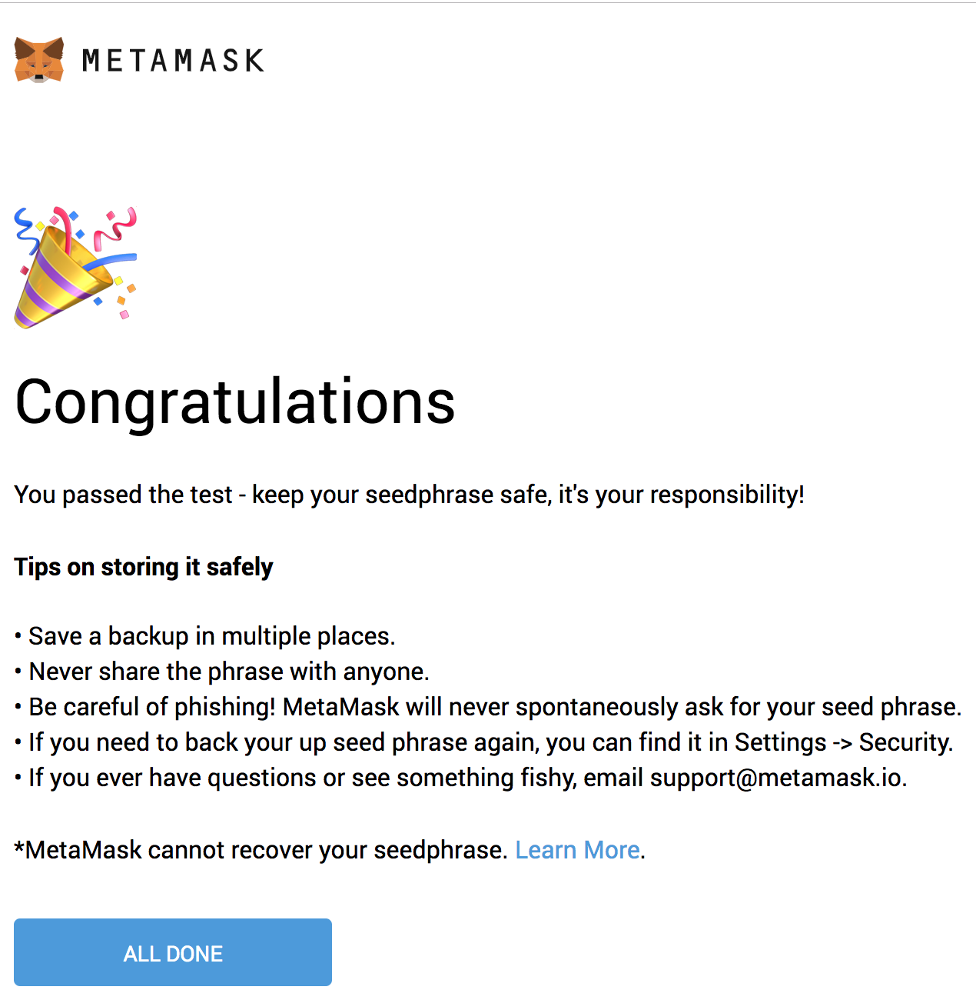

7. Now we need to connect MetaMask to the blockchain created by Ganache. Click the menu that shows "Main Network" and select **Custom RPC**.

   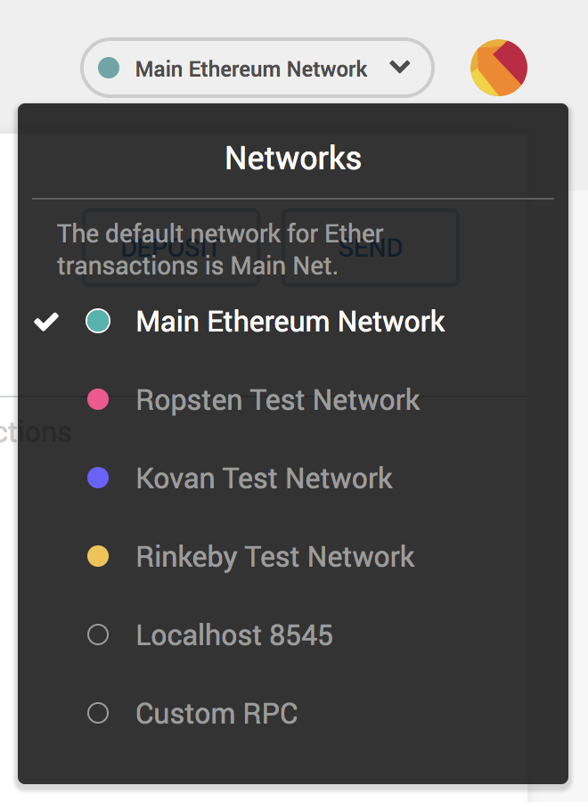

8. In the box titled "New Network" enter `http://127.0.0.1:7545` and click **Save**.

   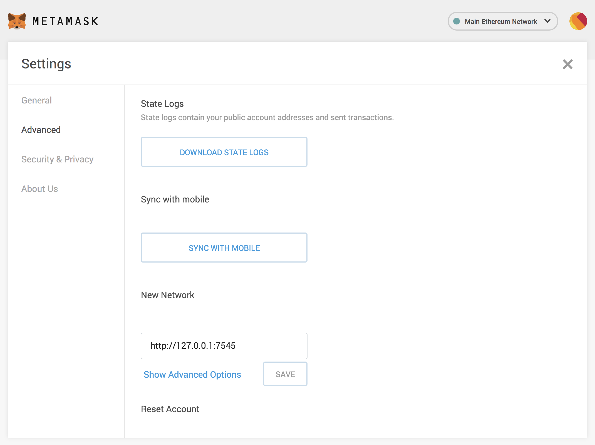

   The network name at the top will switch to say `http://127.0.0.1:7545`.

9. Click the top-right X to close out of Settings and return to the Accounts page.

   Each account created by Ganache is given 100 ether. You'll notice it's slightly less on the first account because some gas was used when the contract itself was deployed and when the tests were run.

   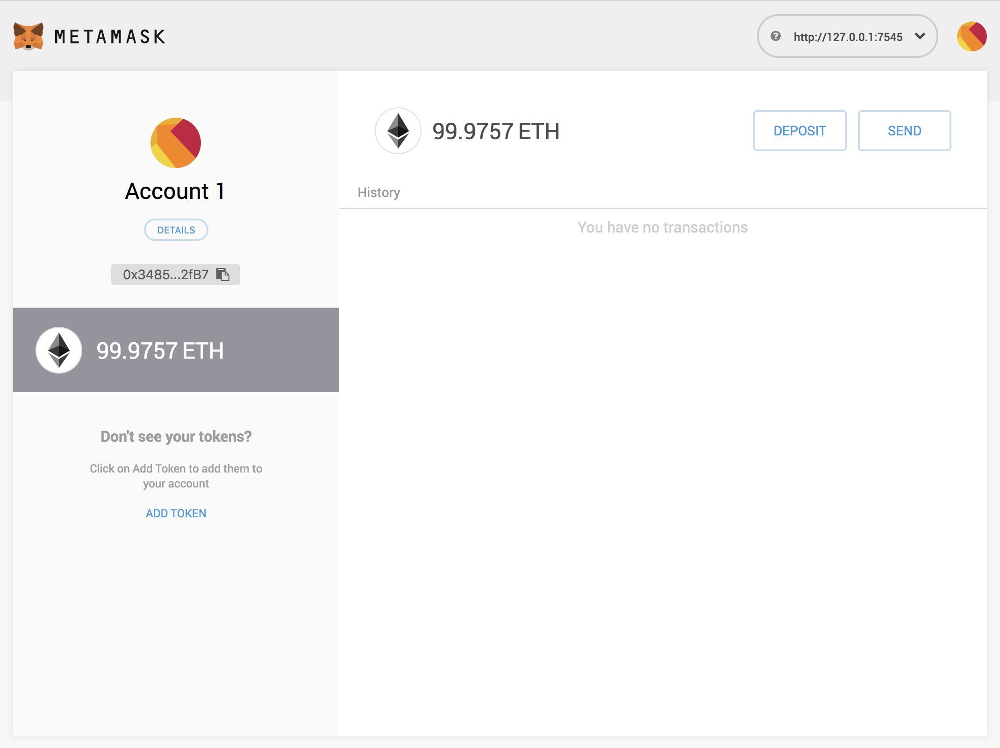

   Configuration is now complete.

### Installing and configuring lite-server

We can now start a local web server and use the dapp. We're using the `lite-server` library to serve our static files. This shipped with the `pet-shop` Truffle Box, but let's take a look at how it works.

1. Open `bs-config.json` in a text editor \(in the project's root directory\) and examine the contents:

   ```javascript
   {
     "server": {
       "baseDir": ["./src", "./build/contracts"]
     }
   }
   ```

   This tells `lite-server` which files to include in our base directory. We add the `./src` directory for our website files and `./build/contracts` directory for the contract artifacts.

   We've also added a `dev` command to the `scripts` object in the `package.json` file in the project's root directory. The `scripts` object allows us to alias console commands to a single npm command. In this case we're just doing a single command, but it's possible to have more complex configurations. Here's what yours should look like:

   ```javascript
   "scripts": {
     "dev": "lite-server",
     "test": "echo \"Error: no test specified\" && exit 1"
   },
   ```

   This tells npm to run our local install of `lite-server` when we execute `npm run dev` from the console.

### Using the dapp

1. Start the local web server:

   ```text
   npm run dev
   ```

   The dev server will launch and automatically open a new browser tab containing your dapp.

   !\[Pete's Pet Shop\]\(../img/pet-shop/dapp.png "Pete's Pet Shop"\)

2. A MetaMask pop-up should appear requesting your approval to allow Pete's Pet Shop to connect to your MetaMask wallet. Without explicit approval, you will be unable to interact with the dapp. Click **Connect**.

   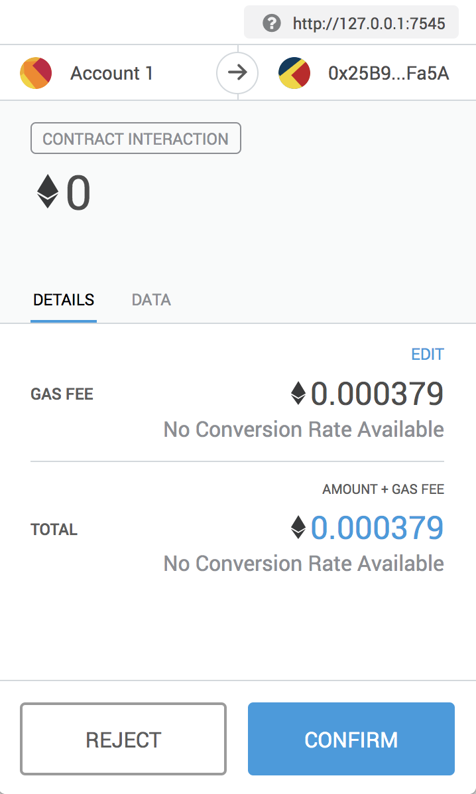

3. To use the dapp, click the **Adopt** button on the pet of your choice.
4. You'll be automatically prompted to approve the transaction by MetaMask. Click **Submit** to approve the transaction.

   

5. You'll see the button next to the adopted pet change to say "Success" and become disabled, just as we specified, because the pet has now been adopted.

   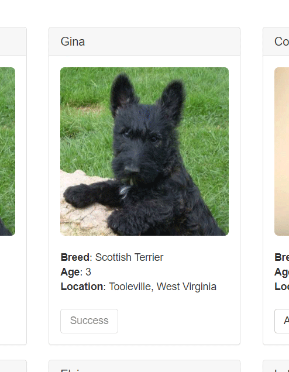

    **Note**: If the button doesn't automatically change to say "Success", refreshing the app in the browser should trigger it.

   And in MetaMask, you'll see the transaction listed:

   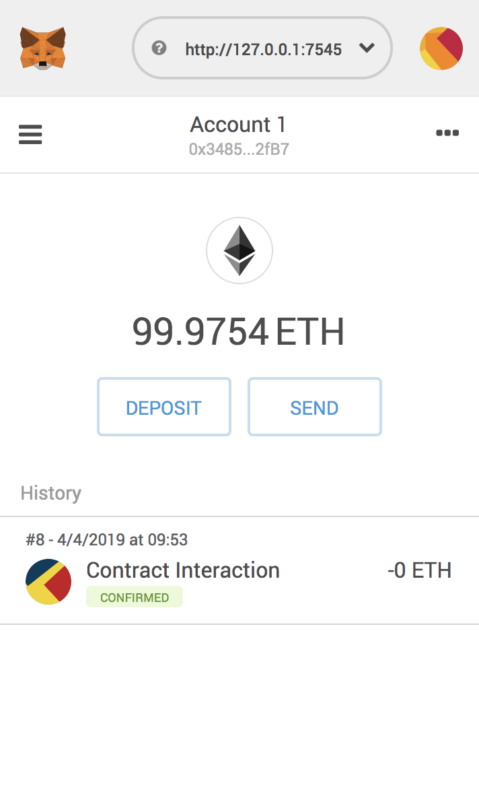

   You'll also see the same transaction listed in Ganache under the "Transactions" section.

Congratulations! You have taken a huge step to becoming a full-fledged dapp developer. For developing locally, you have all the tools you need to start making more advanced dapps. If you'd like to make your dapp live for others to use, stay tuned for our future tutorial on deploying to the Ropsten testnet.

