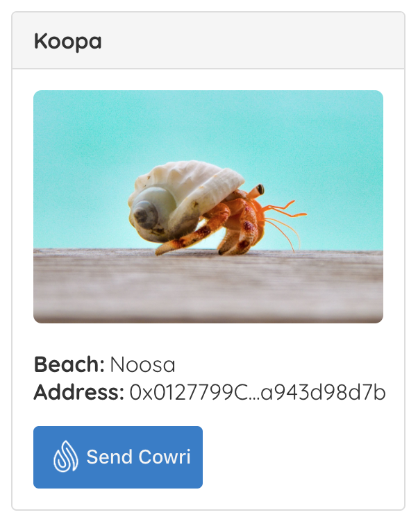

# Cowri Crab Corner Tutorial

This tutorial will take you through the process of building your first dapp---a stablecoin payment protocol integrated into Cowri Crab Corner!

This tutorial is meant for those with a basic knowledge of Ethereum and smart contracts, who have some knowledge of HTML, JavaScript and React, but who are new to dapps.

 **Note**: For Ethereum basics, please read the [Truffle Ethereum Overview](https://www.trufflesuite.com/tutorials/ethereum-overview) tutorial before proceeding.

In this tutorial we will be covering:

1. Setting up the development environment
2. Creating a Truffle project using a Truffle Box
3. Adding Send Cowri to your Application
4. Interacting with the dapp in a browser

## Background

Triton of Cowri Crab Corner is interested in using Cowri as an efficient way to handle their hermit crab donations. As an initial proof of concept, **Triton wants to see a dapp, that associates a cowri shell with a hermit crab to receive donations.**

The website structure and styling will be supplied. **Our job is to integrate with the cowri protocol and front-end logic for its usage.**

## Setting up the development environment

There are a few technical requirements before we start. Please install the following:

* [Node.js v8+ LTS and npm](https://nodejs.org/en/) \(comes with Node\)
* [Git](https://git-scm.com/)

Once we have those installed, we only need one command to install Truffle:

```text
npm install -g truffle
```

To verify that Truffle is installed properly, type `truffle --version` on a terminal. If you see an error, make sure that your npm modules are added to your path.

We also will be using \[Ganache-CLI\]\([https://github.com/trufflesuite/ganache-cli](https://github.com/trufflesuite/ganache-cli)\), a personal blockchain for Ethereum development you can use to deploy contracts, develop applications, and run tests. You can download Ganache-CLI with \`npm install -g ganache-cli\`

 **Note**: You can also use Truffle Develop, Truffle's built-in personal blockchain, instead of Ganache-cli. You will need to change some settings---such as the port the blockchain runs on---to adapt the tutorial for Truffle Develop.

### Installing and configuring MetaMask

Please read prerequisites in [Setup](installation.md#prerequisites)

## Creating a Truffle project using a Truffle Box \(TODO: deploy box to truffle\)

1. Truffle initializes in the current directory, so first create a directory in your development folder of choice and then moving inside it.

   ```text
   mkdir cowri-crab-corner-tutorial

   cd cowri-crab-corner-tutorial
   ```

2. We've created a special [Truffle Box](https://github.com/cowri/cowri-docs/tree/04d9b6dec5ee45ed731242763b10787dc6964125/boxes/README.md) just for this tutorial called `cowri-crab-corner`, which includes the basic project structure as well as code for the user interface. Use the `truffle unbox` command to unpack this Truffle Box.

   ```text
   truffle unbox cowri-crab-corner
   ```

 **Note**: Truffle can be initialized a few different ways. Another useful initialization command is \`truffle init\`, which creates an empty Truffle project with no example contracts included. For more information, please see the documentation on \[Creating a project\]\([https://www.trufflesuite.com/docs/truffle/getting-started/creating-a-project](https://www.trufflesuite.com/docs/truffle/getting-started/creating-a-project)\).

### Directory structure

The default Truffle directory structure contains the following:

* `contracts/`: Contains the [Solidity](https://solidity.readthedocs.io/) source files for our smart contracts. There is an important contract in here called `Migrations.sol`, which we'll talk about later.
* `migrations/`: Truffle uses a migration system to handle smart contract deployments. A migration is an additional special smart contract that keeps track of changes.
* `truffle-config.js`: Truffle configuration file

The `cowri-crab-corner` Truffle Box has extra files and folders in it, but we won't worry about those just yet.

### Start Your Local Development Blockchain

1. Confirm that Ganache-CLI is installed with `ganache-cli --version`
   1. If it is not installed and you see an error, install ganache-cli with `npm install -g ganache-cli`
2. Download and unzip the [Cowri Ganache Snapshot](http://download.cowri.io/cowri-ganache.zip) in `cowri/tutorial`. This snapshot contains the Cowri protocol smart contract.
3. Start Ganache-cli with `ganache-cli --db cowri-ganache --networkId 50 --account '0x43820EB3668B9B86BA8066996826D614DF45D7292FD7D27DBFE4B409982CAA5E, 2000000000000000000' -u 0x40e3ba962dFa3e41d1B54A97199831c2C99f6f37`
4. To see more options with Ganache-cli, run `ganache-cli --help`

### Start the Cowri Liquidity Provider Service

Since Cowri Crab Corner will be using the Ganache development blockchain instead of Kovan for this tutorial, it is necessary to start the [Cowri liquidity provider](https://github.com/cowri/cowri/tree/master/utilities/liquidity) service in order to provide liquidity. You can read more about the liquidity provider [here](https://docs.cowri.io/cowri-overview/architecture#liquidity-pool). To quickly start the liquidity provider service, in a separate terminal:

1. Clone the Cowri monorepo with `git clone http://github.com/cowri/cowri.git`
2. `cd` into `cowri/utilities/liquidity` and run `npm install`
3. To start the liquidty provider service as the Cowri Ganache liquidity provider, run `npm start -- -k ACB02AF912E15578F3A49D0ABDAF8DE136F38045C6F 116FA8D691A610FF005A1 -P 0xE24d0B953961C6109d2bD5786923347B6897eAfB`

### \(Optional\) Start the Cowri Faucet Service

The Cowri Faucet is a service used in development environments to mint \(generate\) test tokens for demonstration purposes. If you wish to experiment with sending Cowri using other test tokens as well, start the Cowri Faucet service by:

1. If you haven't already, clone the Cowri monorepo with `git clone http://github.com/cowri/cowri.git`
2. `cd` into `cowri/utilities/faucet` and run `npm install`
3. Start the faucet as the Cowri Ganache user with `npm start -- -k 43820EB3668B9B86BA8066996826D614DF45D7292FD7D27DBFE4B409982CAA5E -P 0x40e3ba962dFa3e41d1B54A97199831c2C99f6f37 -m 1000000`

### Connect MetaMask to Ganache-CLI and add the Cowri Crab Corner DApp account to MetaMask

1. Open MetaMask in your browser and change the network to `Localhost 8545`
2. Click your MetaMask profile icon and select `Import Account`
3. Paste the following private key and click `Import` `43820EB3668B9B86BA8066996826D614DF45D7292FD7D27DBFE4B409982CAA5E`
4. Click on this new Account and click the pencil icon to change the name to `Cowri Crab Corner DApp`

### Deploy contracts and add minted token to MetaMask

Now that truffle is unboxed we need to compile and migrate our contracts:

1. Make sure you're at the following directory `cowri/tutorial/crab-corner`
2. Run `npm install`. This allows the [OpenZeppelin ERC20 contracts](https://github.com/OpenZeppelin/openzeppelin-contracts/tree/master/contracts/token/ERC20) to be available
3. Enter the truffle development console by typing `truffle develop` in your terminal
4. Type `compile` to create a build folder for our contracts 
5. Type `migrate -network development` to migrate and deploy our contracts to our running Ganache-CLI instance
6. Type `networks` to view all of networks
7. Copy the `CowriMintable` address from the `development (id: 50)` Network
8. Click `Add Token` in MetaMask
9. Paste in the `CowriMintable` address followed by clicking `Next`

Congratulations! You've deployed your own stablecoin and added it to MetaMask. You're now ready to use this token and integrate with Cowri.

### Create the Cowri Shell for the Cowri Crab Corner DApp User

Now that we have MetaMask connected to Ganache and the contracts deployed, we now need to create a shell for the Cowri Crab Corner DApp user with the newly added ERC20 token. To create a shell:

1. Navigate to https://demo.cowri.io
2. Select the option to `Add Token`
3. Paste the address of the ERC20 contract deployed 
4. Optionally, remove the other suggested tokens by checking the box next to each one
5. Click `Make Cowri Shell`. If you didn't start the faucet service earlier, you'll see an error message that says `Network Error`. However, refreshing the page will show that the shell has been created. 

### Instantiating web3

1. Open `client/src/App.js` in a text editor.
2. Examine the file. Note that there is an `App` component to manage our application. When `App` mounts we utilize Reacts useEffect hook to initialize our instance of web3. The [web3 JavaScript library](https://github.com/ethereum/web3.js/) is a tool that interacts with the Ethereum blockchain. It can retrieve user accounts, send transactions, interact with smart contracts, and more.
3. Open `client/src/getWeb3.js`.
4. Remove the multi-line comment from within `retrieveWeb3` and replace it with the following:

   ```javascript
   // Modern dapp browsers...
   if (window.ethereum) {
     const web3 = new Web3(window.ethereum);
     try {
       // Request account access
       await window.ethereum.enable();
       resolve(web3);
     } catch (error) {
       // User denied kjkjkaccount access...
       reject(error);
     }
   } else if (window.web3) {
     const web3 = window.web3;
     resolve(web3);
     // If no injected web3 instance is detected, fall back to Ganache
   } else {
     const provider = new Web3.providers.HttpProvider(
       'http://127.0.0.1:8545',
     );
     const web3 = new Web3(provider);
     resolve(web3);
   }
   ```

Things to notice:

* First, we check if we are using modern dapp browsers or the more recent versions of [MetaMask](https://github.com/MetaMask) where an `ethereum` provider is injected into the `window` object. If so, we use it to create our web3 object, but we also need to explicitly request access to the accounts with `ethereum.enable()`.
* If the `ethereum` object does not exist, we then check for an injected `web3` instance. If it exists, this indicates that we are using an older dapp browser \(like [Mist](https://github.com/ethereum/mist) or an older version of MetaMask\). If so, we get its provider and use it to create our web3 object.
* If no injected web3 instance is present, we create our web3 object based on our local provider. \(This fallback is fine for development environments, but insecure and not suitable for production.\)

### Integrating Send Cowri \(React\)

Now that we can interact with Ethereum via web3, we need to use our Send Cowri component. We can either pass in an instance of web3 or have Send Cowri supply one.

The Send Cowri React component takes the following _optional_ properties:

| Name | Type | Description |
| :--- | :--- | :--- |
| address | `string` | the receiver's public address |
| amount | `number` | the amount of cowri to send |
| web3 | `Web3` | instance of web3 |

1. `cd` into the 'client' directory
2. Install and save `@cowri/send-react`:

   ```bash
   npm install @cowri/send-react --save
   ```

3. In `src/components/CardBody/CardBody.js` add the following import at the top of the file:

   ```javascript
   import SendCowri from '@cowri/send-react';
   ```

4. Remove the following line:

   ```javascript
   <Button text={'Donate'} />
   ```

5. Add `SendCowri` component and pass in `address` and `web3` from props:

   ```javascript
   <SendCowri address={address} />
   ```

## Interacting with the dapp in a browser

Now we're ready to use our dapp!

### Using the dapp

1. Start the local web server:

   ```bash
   cd client
   npm install
   npm start
   ```

   The dev server will launch and automatically open a new browser tab containing your dapp.

   

2. A MetaMask pop-up should appear requesting your approval to allow Cowri Crab Corner to connect to your MetaMask wallet. Without explicit approval, you will be unable to interact with the dapp. Click **Connect**.

   

3. To use the dapp, click the **Send Cowri** button on the hermit crab of your choice.
4. Type in an amount and click **Send**.

   

5. You'll be automatically prompted to approve the transaction by MetaMask. Click **Confirm** to approve the transaction.

   

6. In MetaMask, you'll see the transaction listed:

   

Congratulations! You have successfully integrated Cowri into the Cowri Crab Corner! For developing locally, you have all the tools you need to start making more advanced dapps.

