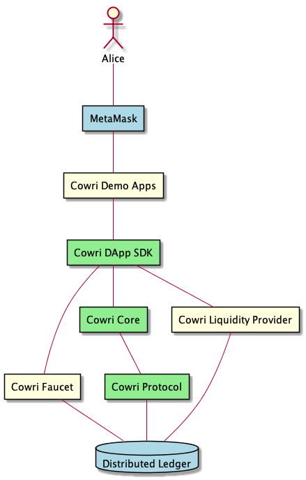

# Developer Toolkit Overview

## Overview

Cowri consists of the following components

## [Cowri Protocol](https://github.com/cowri/shell-manager)

**Cowri Protocol** - The **Cowri Protocol** is Cowri's smart contract layer that is used to manage a user's shell on the blockchain. This management includes:

* Creating a Cowri Shell
* Adding and removing tokens from the shell
* Retrieving and validating tokens in a user's shell

## [Cowri SDK](https://github.com/cowri/cowri/tree/master/sdk)

The **Cowri SDK** refers to the software development toolkit that is available for use by dapp developers. It includes the [**Cowri DApp SDK**](https://github.com/cowri/cowri/tree/master/sdk/cowri-dapp-sdk), [**Cowri Core**](https://github.com/cowri/cowri/tree/master/sdk/cowri-core), and [**Cowri Send**](https://github.com/cowri/cowri/tree/master/sdk/cowri-send). Each of these components are tools that DApp developers can utilize within their applications for interacting with the Cowri protocol.

[**Cowri DApp SDK**](https://github.com/cowri/cowri/blob/master/sdk/cowri-dapp-sdk) - The **Cowri DApp SDK** is the main and most commonly used component of the Cowri SDK. It is the way that developers retrieve and update user metadata, validate tokens based on the address, and, most importantly, send Cowri to another user.

[**Cowri Core**](https://github.com/cowri/cowri/tree/master/sdk/cowri-core) - **Cowri Core** is the blockchain-agnostic module that is home to all the internal Cowri logic and development objects \(Token, User, Transaction, etc\).

[**Cowri Send**](https://github.com/cowri/cowri/tree/master/sdk/cowri-send) - **Cowri Send** is a reusable UI element which can be easily added to any DApp to unlock the Cowri payment functionality.

## Cowri Utilities

The **Cowri Utilities** are the back end services that allow Cowri to run as a whole. The utilities consist of [**Ganache**](https://www.trufflesuite.com/ganache), the **Faucet**, and the **Cowri Liquidity Provider**. In order for local development of Cowri to take place, the **Cowri Utilities** must be running in the background of the development machine. They include

**Cowri Faucet** - The **Cowri Faucet** is responsible for minting test tokens for users in both Ganache and Kovan Networks. It is not used for mainnet.

**Cowri Liquidity Provider** - The **Cowri Liquidity Provider** is the service responsible for providing liquidity to the Cowri send protocol. It currently runs using the [**0x Protocol**](https://0x.org/#) and is leveraged in the case when sending cowri requires a swapping of stable coins.

**Cowri Ganache - Distributed Ledger** - **Cowri Ganache** is a pre-configured [ganache](https://www.trufflesuite.com/ganache) instance complete with all the [master data](masterdata.md) needed to run and test Cowri applications.

## Cowri Sample Applications

The **Cowri Sample Applications** are provided as reference tools to assist developers in understanding how to leverage Cowri capabilities. There are currently two Sample Applications:

[**Cowri Shell**](https://github.com/cowri/cowri/tree/master/utilities/cowri-shell) - The **Cowri Shell** DApp is a web application that integrates with the browser addon [MetaMask](https://metamask.io/) to provide an interactive demonstration of the capabilities available with the Cowri protocol.

**Cowri Pet Shop** - **Cowri Pet Shop** is based on the popular [**Pet Shop Truffle Box**](https://www.trufflesuite.com/boxes/pet-shop) and has been enhanced to support payment using multiple stable coins via Cowri.

## Additional Components

[**MetaMask**](https://metamask.io/) - Cowri currently leverages **MetaMask** as the Wallet Provider for the initial developer release.

**Distributed Ledger** - Cowri has built its initial developer release on [Ethereum](https://www.ethereum.org/) and has provided the cowri protocol to developers both in a standalone [ganache](https://github.com/trufflesuite/ganache) instance as well as on the [Kovan Network](https://kovan-testnet.github.io/website/). Moving forward the Cowri Protocol will support deployment on multiple blockchains.

