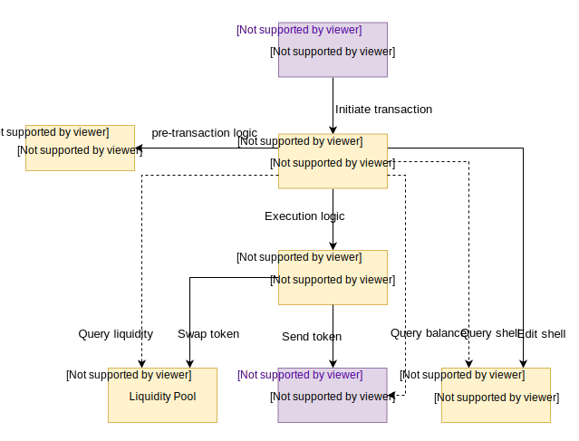

# Architecture

The current version \(v0.2\) of the Cowri Shell Protocol built a [stablecoin liquidity pool](protocol-description.md#protocol-implementation) using the [0x Protocol](https://0x.org/). Going forward, future versions \(v1.0+\) will use a liquidity pool more akin in design to [Uniswap](https://uniswap.io/), although with significant modifications. The new design will enable atomically swapping multiple stablecoins without any off-chain coordination, which is a limitation of the current design. Both the current version \(v0.2\) and the new version \(v1.0\) are included in our architecture documentation.

## Version 0.2.0

Version 0.2 is the architecture in place until version 1.0 of the protocol has finished development. It is live on the Ethereum test net, Kovan. It has been built in such a way that the current off-chain logic of the liquidity provider can easily be replaced with the on-chain protocol once it is completed, so it is important to understand that while version 0.2 is functional, certain components will be replaced. Version 0.2 consists of the following modules:

### Shell ledger

The shell ledger tracks users' stablecoin shell, i.e. which stablecoins they accept. It is a mapping of the users' address and an array of stablecoin contract addresses.

### Shell manager

The shell manager consists of the following two subcomponents:

#### DApp SDK

The DApp SDK is the keystone of the Cowri protocol and acts as the central hub for developer interaction with the functions available with Cowri. It interacts with all the other Cowri modules either by calling code directly or interacting with them via network protocols. The DApp SDK is available on [NPM](https://www.npmjs.com/package/@cowri/dapp-sdk) and can easily be installed and implemented for any DApp developer to use Cowri in their applications.

#### Core logic

The core logic is where all of the core business logic takes place. It decomposes a send transaction into a series of stablecoin swaps and sends. These algorithms form the core of the Cowri Shell Protocol. The core logic is an [NPM module](https://www.npmjs.com/package/@cowri/core) as to allow its internal objects to be shared amongst the Faucet, Liquidity Provider, and any other service that would like access to these objects and algorithms.

### Liquidity pool

The liquidity pool for version 0.2 is built using the [0x Protocol.](https://0x.org/) Coordination between the user and the liquidity provider \(see [Utilities](architecture.md#utilities)\) is handled by the DApp SDK. The stablecoin swaps are executed on the 0x exchange contract. The liquidity pool will be one of the main differences between version 0.2 and version 1.0.

### Utilities

The following utilities are provided for developers who would like to build and test applications using Cowri. There are the following two sub-modules:

#### Faucet

The Faucet is an API service built on Express that allows for the minting of supported ERC20 tokens for development purposes on test networks. It runs as a standalone service alongside the other Cowri services and can be started using either Docker or with an NPM script. An image for the faucet has also been published to Docker Hub.

#### Liquidity Provider

The Liquidity Provider is also a standalone API service built on Express that currently provides liquidity to the Cowri protocol. Like the Faucet, an image for the liquidity provider has been published to Docker Hub and also can be started with an NPM command. It utilizes the 0x protocol and is leveraged when sending Cowri that requires the swapping of stable coins. The Liquidity Provider API service is intended to be a temporary yet functional liquidity solution while the on-chain components are being developed.

## Version 1.0

Version 1.0 is the future architecture being developed. It currently is not deployed on any test net, unlike version 0.2. This version contains the following components:

### Shell ledger

The shell ledger tracks users' stablecoin shell, i.e. which stablecoins they accept. It is a mapping of the users' address and an array of stablecoin contract addresses.

### Shell manager

The shell manager consists of the following three subcomponents:

#### DApp SDK

The DApp SDK is the keystone of the Cowri protocol and acts as the central hub for developer interaction with the functions available with Cowri. It interacts with all the other Cowri modules either by calling code directly or interacting with them via network protocols. The DApp SDK is available on [NPM](https://www.npmjs.com/package/@cowri/dapp-sdk) and can easily be installed and implemented for any DApp developer to use Cowri in their applications.

#### Core logic

The core logic is where all of the core business logic takes place. It decomposes a send transaction into a series of stablecoin swaps and sends. These algorithms form the core of the Cowri Shell Protocol. The core logic is an [NPM module](https://www.npmjs.com/package/@cowri/core) as to allow its internal objects to be shared amongst the Faucet, Liquidity Provider, and any other service that would like access to these objects and algorithms.

#### Sequencer

The sequencer is the only sub-module of the shell manager that exists on-chain. Its function is to batch a series of stablecoin swaps and sends \(as determined by the core logic\) into a single, atomic transaction \(i.e. one block\). In principle, the sequencer can be accessed by any third party, without needing to invoke the core logic or the DApp SDK. DeFi protocols will access Cowri via the sequencer.

### Liquidity pool

The liquidity pool is similar in design to [Uniswap](https://uniswap.io/), except without ether as an intermediate currency. Instead, it has direct stablecoin-to-stablecoin swaps. Liquidity providers stake tokens and earn fees for each trade. They will only have exposure to the stablecoins listed in their shell. Even if liquidity providers do not agree on which stablecoins to support, they can still pool their liquidity together. More details will be provided closer to the version 1.0 release.

