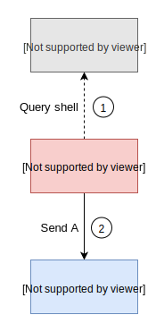
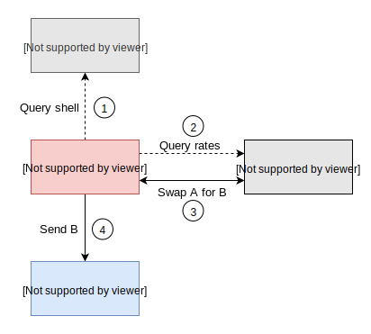

# Protocol Description

## Stablecoin shells

Although stablecoins are highly fragmented, they are also highly fungible. This is the fundamental insight of the Cowri Shell Protocol. Users ultimately will not care to differentiate between stablecoins because each stablecoin is pegged to the same underlying asset, typically the USD. The only prerequisite is that there is adequate liquidity and adequate protection from a permanently broken peg \(e.g. price = $0\).

However, users may not all agree on which stablecoins to use. Some may prefer the stability of fiat-backed tokens, some may prefer the decentralization of crypto-backed tokens. This leads us to the concept of stablecoin shells. A shell is a list of stablecoins a user is willing to accept as fungible to each other. 

We use the term, "stablecoin shell," because Cowri acts as a wrapper over the underlying assets. Hence, it is a "shell" for the actual stablecoins. Building on top of this concept, we can develop a set of logical procedures that will ensure users will always receive the stablecoins listed in their shell.

## Payments using shells

If Alice wants to pay Bob $50 with cowri, there are two possible scenarios:

1. Alice and Bob have overlapping shells \(see Figure 1\)
2. Alice and Bob do not have overlapping shells \(see Figure 2\)

In the first scenario, Alice can complete the payment by sending some combination of stablecoins already in her wallet that sum up to $50.

In the second scenario, Alice will have to use an intermediary, Claire. Claire has a shell that overlaps with both Alice and Bob. Alice sends $50 \(plus a fee\) of stablecoins to Claire, Claire then sends $50 to Bob. 

## Protocol implementation

To implement the protocol, there are three main modules:

1. Shell ledger
2. Shell manager
3. Liquidity pool

The shell ledger tracks which stablecoins a user has in their shell \(i.e. which stablecoins they will accept in their wallet\). The shell manager handles the transaction logic and connects the front-end application to the back-end protocol. The liquidity pool provides liquidity between stablecoins when a user needs to swap tokens. The pool also is accessible to anyone who would like to swap between stablecoins, whether they are using the broader protocol or not.

### Transaction flow

To see how the protocol works, consider Alice paying Bob $50 in cowri. If Alice and Bob have the same stablecoin shell, then the transaction will follow these steps:

1. Alice’s shell manager queries the shell ledger for Bob’s shell
2. Alice sends to Bob $50 worth of stablecoin A 

If Alice and Bob do not have the same stablecoin shell, then the transaction will follow these steps:

1. Alice’s shell manager queries the shell ledger for Bob’s shell
2. The shell manager queries the liquidity pool for swap rates
3. The shell manager swaps stablecoins
4. The shell manager sends $50 worth of stablecoin B to Bob

