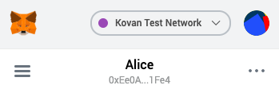
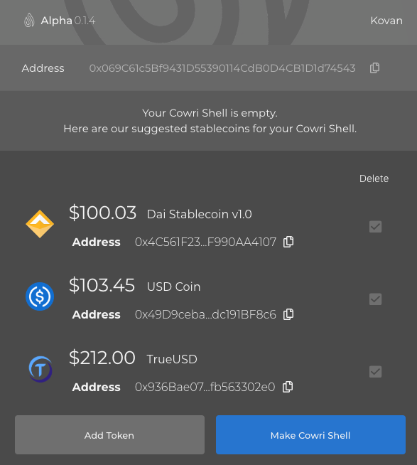
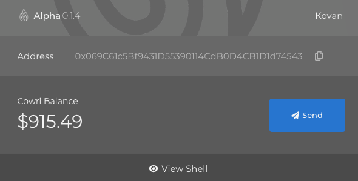
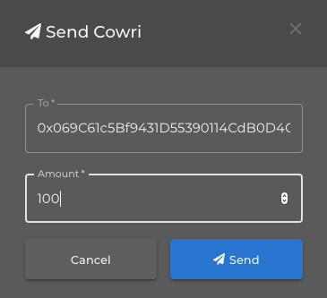
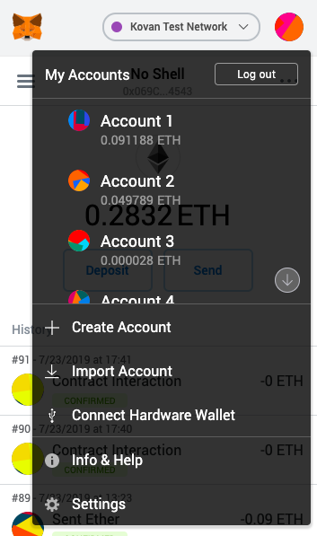

# Tutorial

This tutorial explains how to get started with the Cowri Shell demo app. We built this demo to showcase our protocol. If you would like to learn more about our project, you can read the [white paper](https://docs.cowri.io/whitepaper) or our [FAQs](https://docs.cowri.io/FAQ).

If you are a developer interested in integrating Cowri into a project, see our [developer guide](https://docs.cowri.io/developer_tutorial).

## Prerequisites:

To use the Cowri Shell demo app, you first need to install [Metamask](https://metamask.io/), which is available as a plug-in for Chrome, Firefox and Brave browsers. Once you have installed the Metamask plug-in, be sure to set your network to “Kovan”.

If this is your first time using Metamask on Kovan, you will need to get some test Ether. You can find a Kovan Ether faucet [here](https://gitter.im/kovan-testnet/faucet) or [here](https://faucet.kovan.network/).

## Getting started

To get started, you first need to create your Cowri shell. A shell is the list of stablecoins you are willing to accept in your crypto wallet. The app will recommend a default list of stablecoins to help you get started. A full list of stablecoins supported on test net can be found **here**. You can add stablecoins to your shell by clicking the “Add Token” button and pasting the address of the token you would like to add.

When you are satisfied with you shell, click “Make Cowri Shell”. Your shell will be registered and the Cowri Faucet will automatically send you some test tokens.

## Viewing and editing your shell

Cowri is designed so that you do not need to actively manage the stablecoins in your shell. If you would like to view the individual balances of your stablecoins, click, “View Shell”. If you would like to make additional changes to your shell, you can click “Edit Shell”. You can add and delete tokens from there, but don’t forget to click “Save” if you want your updates to be permanent.

## Sending cowri

Sending cowri is as easy as sending a single stablecoin. All you need to do is pick a recipient address and the amount you want to send. As long as that recipient address has also registered a shell, the protocol will take care of the rest.

For the purposes of the demo tutorial, you may want to switch to a new Metamask account and register a second shell. You can switch accounts by clicking the icon in the top right corner of your plug-in drop down menu. Once you have switched accounts, the application should automatically restart and prompt you to create a new shell for that account.

## Experimenting with different shells

The true utility of the Cowri Shell Protocol is that not every user needs to have the same shell. Try sending cowri between Metamask accounts with different shells and see what happens. Even if users have no common stablecoins between them, transactions should still happen seamlessly \(minus a few extra Metamask popups\).

## Conclusion

That's it for the Cowri User Tutorial. We hope you liked it! If you are so inclined, we'd love to have your feedback. Effusive praise is always welcome, but we prefer constructive criticism. So if you have any ideas on how we can make the user experience better, we are all ears...

And thanks again for checking us out, The Cowri Team

