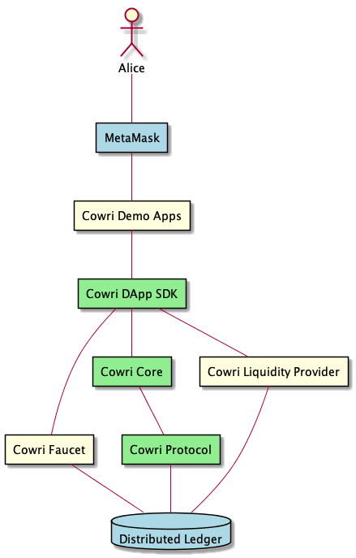

# Developer Guide

## Overview
Cowri consists of the following components

## [Cowri Protocol](https://github.com/cowri/shell-manager)

**Cowri Protocol** - The Cowri Protocol is Cowri's smart contract layer. It currently manages a users shell.  

## [Cowri SDK](https://github.com/cowri/cowri-sdk)

The Cowri SDK currently has two main components both of which can be installed as NPM packages.

**[Cowri DApp SDK](https://github.com/cowri/cowri-sdk/tree/master/cowri-dapp-sdk)** - Cowri DApp SDK is the DApp developers touch point for integrating with Cowri and provides the capabilities to manage a users shell and send Cowri.

**[Cowri Core](https://github.com/cowri/cowri-sdk/tree/master/cowri-core)** - Cowri Core integrates all the functionality provided by the Cowri Protocol as well as Cowri Utilities. It also contains logic around managing users, tokens and algorithms to calculate the most efficient way to send Stable Coins from one user to another.

## Cowri Utilities
Cowri Utilities are applications Cowri has written to facilitate developers in building and testing their producsts.
They include

**Cowri Faucet** - The Cowri faucet is responsible for minting test tokens for users in both Ganache and Kovan Networks. It is not used for mainnet.

**[sendCowri](https://github.com/cowri/cowri-demo-apps/tree/master/sendCowri) - sendCowri is a reusable UI element which can be easily added to any DApp to unlock the Cowri payment functionality.

**Cowri Liquidity Provider** - The Cowri Liquidity provider is currently built on the [0x Protocol](https://0x.org/#) and is leveraged when sending cowri requires a swapping of stable coins.

**Cowri Ganache - Distributed Ledger** - Cowri ganache is a pre-configured [ganache](https://www.trufflesuite.com/ganache) instance complete with all the [masterData](./masterData.md) needed to run and test Cowri Applications.  

## Cowri Sample Applications
Cowri Sample applications are provided to assist developers in learning how to leverage Cowri capabilities. Currently there are two Sample Applications

**[Cowri Shell](https://github.com/cowri/cowri-demo-apps/tree/master/cowri-shell)** - The Cowri Shell DApp provides the ability to manage a users Shell and Send Cowri. 

**Cowri Pet Shop** - Cowri Pet Shop is based on the popular [Pet Shop Truffle Box](https://www.trufflesuite.com/boxes/pet-shop) and has been enhanced to support payment using multiple stable coins via Cowri.

## Additional Components

**[MetaMask](https://metamask.io/)** - Cowri currently leverages MetaMask as the Wallet Provider for the initial developer release.

**Distributed Ledger** - Cowri has built it's initial developer Release on [Ethereum](https://www.ethereum.org/) and has provided the cowri protocol to developers,  both in a standalone [ganache instance](https://github.com/trufflesuite/ganache) as well as on the [Kovan Network](https://kovan-testnet.github.io/website/). Moving forward the Cowri Protocol will support deployment on multiple blockchains.
